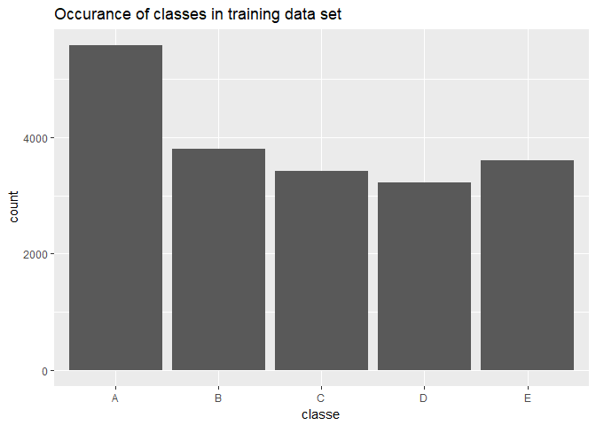
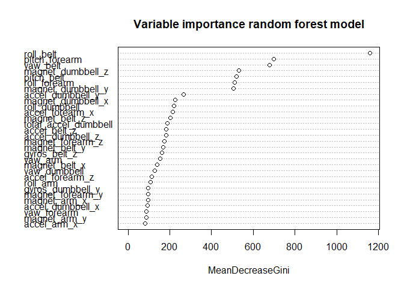

# Practical machine learning course project
Bram van Dam  
July 8, 2017  




# Executive summary
Using data of four sensors monitoring movement of people performing a prescribed exercise (Unilateral Dumbbell Biceps Curl), a model is built that accurately predicts if the exercise is carried out in the correct manner or not. Not only predicts the model if the exercise is performed correctly, but if not performed correctly four different mistakes can be predicted as well. The (random forest) model classifies with an overall accuracy of 99.1%.


# Introduction

Weight lifting exercises are performed by 6 different individuals and were monitored using four sensors (on arm, forearm belt and dumbbell). The execution of the prescribed exercise is monitored and classified A to E (with A "correct" and other labels representing common mistakes). Further documentation on the data and a paper can be found in [1] and [2].

Our goal is to develop a (machine learning) model which identifies the correct classification (A-E) given a set of measurements from the sensors.

The final model is used to predict the classification for a given test set.


# Analysis
The analysis is in three stages: first the data is explored and cleaned, then a model is developed and the resulting model is applied to the prescribed test set.
Finally, a conclusion is stated.

## Data download - explore - clean

Training and test data were provided:  
* training data: https://d396qusza40orc.cloudfront.net/predmachlearn/pml-training.csv  
* test data: https://d396qusza40orc.cloudfront.net/predmachlearn/pml-testing.csv  
These data sets are first imported into R.


```r
url_train <- "https://d396qusza40orc.cloudfront.net/predmachlearn/pml-training.csv"
url_test <- "https://d396qusza40orc.cloudfront.net/predmachlearn/pml-testing.csv"

file_train <- "./Data/pml-training.csv"
file_test <- "./Data/pml-testing.csv"

# make Data subdir if necessary
if (!file.exists("Data")) {
    dir.create("Data")
}

# Download trainig file & get into R
if (!file.exists(file_train)) {
    download.file(url = url_train, destfile = file_train)
}
if (!file.exists(file_test)) {
    download.file(url = url_test, destfile = file_test)
}

# Read files into R
train_0 <- read.csv("./Data/pml-training.csv")
test_0 <- read.csv("./Data/pml-testing.csv")
```

From the plot below we see that all classes do occur (a lot) in the training dataset.

```r
# Check distribution classes
ggplot(train_0,aes(classe)) + geom_bar() + ggtitle("Occurance of classes in training data set")
```

<!-- -->

Several "observations" (where `new_window` = "yes") look like summaries of other variables in a time window (however, the summaries cannot be reproduced so maybe these are linked to the wrong time windows). These "observations" are removed from the dataset.  
Looking further into the data (after removing the "observations" described above), a lot of variables are either always "NA" or always empty; these variables are removed from the training data.  
Another observation is that, since the test set does not contain summaries (over a time frame) of sensor variables, the timestamp variables and data on time windows are excluded as well.  
As final cleaning task, the variables `X` (just a counter) and `user_name` (prediction should not depend on name or individual) are excluded.
The remaining predictors are all data from the sensors, which makes sense.


```r
# observations with new_window="yes": see link above on forum: remove these rows
train_1 <- train_0[train_0$new_window == "no", ]

# Remove NA-variables
na_count <- colSums(is.na(train_1))
na_names <- names(na_count[na_count==nrow(train_1)])
train_2 <- train_1[, !(names(train_1) %in% na_names)]

# remove these variables
empty_count <- colSums(train_2=="")
empty_names <- names(empty_count[empty_count==nrow(train_2)])
train_3 <- train_2[, !(names(train_2) %in% empty_names)]
# Maar dit moet ook met near zero variance eruit rollen!

# Remove other variables that don't make sense:
ovtdms_names <- c("X", "user_name", "raw_timestamp_part_1", "raw_timestamp_part_2", "cvtd_timestamp", "new_window", "num_window")
train_4 <- train_3[, !(names(train_3) %in% ovtdms_names)]

# clean environment
rm(list= ls()[!(ls() %in% c("test_0", "train_4"))]) 
```

## Model development
Model development is performed in three steps: starting with theory we build several models and finally select the "best" model.

### Theory
Since the goal is to classify, three model types are examined:
* classification tree (method "rpart")  
* random forest (method "rf")  
* boosting (using "gbm")  
To avoid overfitting (especially for the random forest model), cross validation is used. To speed up calculations, parrallel processing is used (refer to [3] for explanation). Whilst the normal classification tree has good interpretability, usually random forest and boosting lead to better accuracy. The trade-off will be made after testing.

### Building
As a first step, the training data is split into a "training" and a "testing" set (not to be confused with the test set provided for the final prediction). The training set is 60% of the total training data, leaving 40% for the testing set.


```r
set.seed(2412)

# divide "training" into "train" and "test" set.
inTrain <- createDataPartition(train_4$classe, p=0.6, list = FALSE)
train_1 <- train_4[inTrain,]
test_1 <- train_4[-inTrain,]
# split train_1 in x and y to allow S3-method call instead of formula call (may give problems)
x <- train_1[,-53]
y <- train_1[, 53]
```

Then, using parallel processing to increase computation speed, the three models are constructed.


```r
library(parallel)
library(doParallel)
cluster <- makeCluster(detectCores() - 1) # convention to leave 1 core for OS
registerDoParallel(cluster)

fitControl <- trainControl(method = "cv",
                           number = 10,
                           allowParallel = TRUE)

# Rpart classification tree
fitRpart <- train(x, y, method = "rpart", trControl = fitControl)

# Random forest
fitRf <- train(x, y, method = "rf", trControl = fitControl)

# Gradient boosting
fitGbm <- train(x, y, method = "gbm", trControl = fitControl, verbose = FALSE)

stopCluster(cluster)
registerDoSEQ()
```

Accuracy as calculated from the in-sample predictions are shown below:

```r
# Asses training accuracy
predictRpart_train_1 <- predict(fitRpart, train_1)
predictRf_train_1 <- predict(fitRf, train_1)
predictGbm_train_1 <- predict(fitGbm, train_1)

rbind("Classification tree" = confusionMatrix(train_1$classe, predictRpart_train_1)$overall["Accuracy"],
      "Random forest" = confusionMatrix(train_1$classe, predictRf_train_1)$overall["Accuracy"],
      "Boosting" = confusionMatrix(train_1$classe, predictGbm_train_1)$overall["Accuracy"])
```

```
##                      Accuracy
## Classification tree 0.4929761
## Random forest       1.0000000
## Boosting            0.9771939
```

From these accuracies, the random forest is the highest, and the "simple" classification tree (method rpart) seems way too low to be used as a model to predict accurately.

### Selection
However, in-sample accuracy is not a good measure, since it is calculated on the same data the model was built on. Hence, out-of-sample accuracy will be used as selection critrion. These out-of-sample accuracies are shown below:


```r
# Asses testset accuracy
predictRpart_test_1 <- predict(fitRpart, test_1)
predictRf_test_1 <- predict(fitRf, test_1)
predictGbm_test_1 <- predict(fitGbm, test_1)

rbind("Classification tree" = confusionMatrix(test_1$classe, predictRpart_test_1)$overall["Accuracy"],
      "Random forest" = confusionMatrix(test_1$classe, predictRf_test_1)$overall["Accuracy"],
      "Boosting" = confusionMatrix(test_1$classe, predictGbm_test_1)$overall["Accuracy"])
```

```
##                      Accuracy
## Classification tree 0.4983082
## Random forest       0.9908902
## Boosting            0.9619990
```

Again, the random forest predicts with the highest accuracy (99.1%), on the (not used for training) samples as well. Hence, the random forest model will be selected for prediction.

Before this model is used to predict on the seperate test set (not the held-out part of the training set used above to estimate accuracy), some statistics on the random forest model are discussed.


```r
confusionMatrix(test_1$classe, predictRf_test_1)
```

```
## Confusion Matrix and Statistics
## 
##           Reference
## Prediction    A    B    C    D    E
##          A 2180    8    0    0    0
##          B   13 1468    6    0    0
##          C    0    7 1327    6    0
##          D    0    1   17 1239    1
##          E    0    1    3    7 1400
## 
## Overall Statistics
##                                           
##                Accuracy : 0.9909          
##                  95% CI : (0.9885, 0.9929)
##     No Information Rate : 0.2854          
##     P-Value [Acc > NIR] : < 2.2e-16       
##                                           
##                   Kappa : 0.9885          
##  Mcnemar's Test P-Value : NA              
## 
## Statistics by Class:
## 
##                      Class: A Class: B Class: C Class: D Class: E
## Sensitivity            0.9941   0.9886   0.9808   0.9896   0.9993
## Specificity            0.9985   0.9969   0.9979   0.9970   0.9982
## Pos Pred Value         0.9963   0.9872   0.9903   0.9849   0.9922
## Neg Pred Value         0.9976   0.9973   0.9959   0.9980   0.9998
## Prevalence             0.2854   0.1933   0.1761   0.1629   0.1823
## Detection Rate         0.2837   0.1910   0.1727   0.1612   0.1822
## Detection Prevalence   0.2847   0.1935   0.1744   0.1637   0.1836
## Balanced Accuracy      0.9963   0.9927   0.9894   0.9933   0.9988
```
From the confusion matrix (and accompanying output), the overall accuracy of 99.1% can be read. Furthermore, sensitivity and specificity are high, almost all above 98%. 

To gain some insight in the important variables in the model, the following plot is shown.


```r
varImpPlot(fitRf$finalModel, main = "Variable importance random forest model")
```

<!-- -->

It shows that the most important variables to predict the class are `roll_belt`, `pitch_forearm`, `yaw_belt`,  `magnet_dumbbell_z`, `pitch_belt`, `roll_forearm` and `magnet_dumbbell_y`.


## Results on test cases
The results of the prediction with selected model on the (seperate) test set are as follows:


```r
predictRf_test_0 <- predict(fitRf, test_0)
predictRf_test_0
```

```
##  [1] B A B A A E D B A A B C B A E E A B B B
## Levels: A B C D E
```

The correct classification for this test set are not known (to me), so this prediction cannot be evaluated.

## Conclusion
Testing for several models, the random forest model gave the best results in predicting the correct classification of the execution of dumbbell exercise. This model predicts the classification with an (estimated) accuracy of 99.1%.


# References

[1] Original data: http://groupware.les.inf.puc-rio.br/har  
[2] Research paper: 
Velloso, E.; Bulling, A.; Gellersen, H.; Ugulino, W.; Fuks, H. Qualitative Activity Recognition of Weight Lifting Exercises. Proceedings of 4th International Conference in Cooperation with SIGCHI (Augmented Human '13) . Stuttgart, Germany: ACM SIGCHI, 2013.  
[3] Parallel processing setup: https://github.com/lgreski/datasciencectacontent/blob/master/markdown/pml-randomForestPerformance.md  
